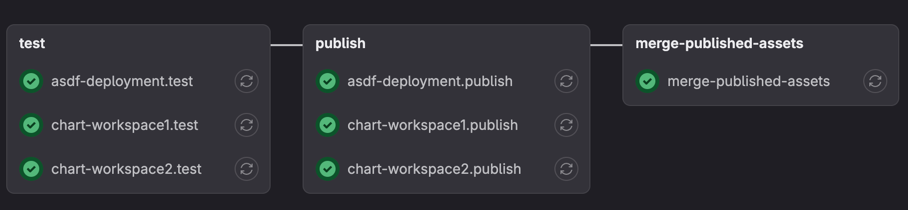

<h1 align="center" style="border-bottom: none;">🦊 @pubgcorp/semantic-release-gitlabmonorepo</h1>

<h3 align="center">Semantic Release GitLab Monorepo Plugin</h3>

<p align="center">
  A <a href="https://semantic-release.gitbook.io/semantic-release/">semantic-release</a> plugin for GitLab monorepo.
</p>

<p align="center">
  <a href="https://www.npmjs.com/package/@pubgcorp/semantic-release-gitlabmonorepo">
    
  </a>
</p>

---

| Step               | Description                                                               |
|--------------------|---------------------------------------------------------------------------|
| `verifyConditions` | Verify the presence of some requirements environment and config variable. |
| `publish`          | Push a Git Assets for the package.                                        |

## Install

```bash
npm install -D @pubgcorp/semantic-release-gitlabmonorepo
```

## Usage

The plugin can be used by adding it to the `plugins` field in the `release` configuration of your `package.json`.

.releaserc
```json
{
  "plugins": [
    "@semantic-release/commit-analyzer",
    "@semantic-release/release-notes-generator",
    [
      "@semantic-release/changelog",
      {
        "changelogFile": "CHANGELOG.md"
      }
    ],
    "@semantic-release/npm",
    [
      "@pubgcorp/semantic-release-gitlabmonorepo",
      {
        "gitlabUrl": "https://gitlab.tythonic.com",
        "assets": [
          {
            "path": "CHANGELOG.md"
          },
          {
            "path": "package.json"
          }
        ]
      }
    ]
  ]
}
```

Root CI configuration:

```yaml
stages:
  - publish

.publish:
  stage: publish
  before_script:
    - npm ci
  script:
    - cd ${PACKAGE_PATH}
    - npx semantic-release
  rules:
    - if: $CI_COMMIT_BRANCH == $CI_DEFAULT_BRANCH
      changes:
        paths:
          - $PACKAGE_PATH/**/*

include:
  - local: "**/.gitlab-ci.yml"
```

Each package CI configuration:

```yaml
my-package.publish:
  extends: .publish
  variables:
    PACKAGE_PATH: my-package
```

With this configurations, the plugin will push the `CHANGELOG.md` and `package.json` files to the GitLab repository.

## Configuration

### Gitlab authentication

The GitLab authentication is done using the `GITLAB_TOKEN` or `GITLAB_ACCESS_TOKEN` environment variable. The token must
have the `api` scope.

### Environment variables

| Variable                                | Description                                             |
|-----------------------------------------|---------------------------------------------------------|
| `GITLAB_TOKEN` or `GITLAB_ACCESS_TOKEN` | *Required.* The token used to authenticate with GitLab. |
| `CI_SERVER_URL`                         | *Optional.* The gitlab endpoint.                        |
| `CI_PROJECT_ID` or `CI_PROJECT_PATH`    | *Optional.* The project identifier.                     |

The above environment variables are automatically set by GitLab CI/CD.

If you are using this plugin on GitLab CI/CD, you don't need to set any environment variables.

### GitLab Monorepo Plugin Options

| Option        | Description                                            | Default                                                                                  |
|---------------|--------------------------------------------------------|------------------------------------------------------------------------------------------|
| `gitlabUrl`   | *Optional.* The GitLab URL.                            | `CI_SERVER_URL` environment variable or `https://gitlab.com`                             |
| `projectId`   | *Optional.* The GitLab project ID.                     | `CI_PROJECT_ID` or `CI_PROJECT_PATH` environment variable or read from git `origin` url. |
| `commitTitle` | *Optional.* The commit title message to pushed assets. | `chore(release): ${nextRelease.name} [skip ci]`                                          |
| `branchName`  | *Optional.* The branch name to merge each assets.      | `assets/${commit.short}`                                                                 |
| `assets`      | *Optional.* The assets to be pushed.                   | `[]`                                                                                     |

## commitTitle and branchName template

The `commitTitle` and `branchName` options support the following template variables:

| Variable               | Description            |
|------------------------|------------------------|
| `nextRelease.name`     | The release version.   |
| `nextRelease.type`     | The release type.      |
| `nextRelease.notes`    | The release notes.     |
| `lastRelease.version`  | The release version.   |
| `lastRelease.gitTag`   | The release git tag.   |
| `lastRelease.channels` | The release channels.  |
| `lastRelease.gitHead`  | The release git head.  |
| `lastRelease.name`     | The release name.      |
| `branch`               | The branch name.       |
| `commit.full`          | The full commit hash.  |
| `commit.short`         | The short commit hash. |

## Example Monorepo Pipeline

With this plugin, you can run multiple semantic-release in a single pipeline like below.



Add a `merge-published-assets` stage at the end of the Gitlab CI to merge the releases of each package.

```yaml
merge-published-assets:
  stage: merge-published-assets
  when: on_success
  variables:
  script:
    - npm install --global @pubgcorp/semantic-release-gitlabmonorepo
    - export SHORT_COMMIT_HASH=$(git rev-parse --short HEAD)
    - set -x
    - semantic-release-gitlabmonorepo-helper create --project-id $CI_PROJECT_ID --source-branch "assets/${SHORT_COMMIT_HASH}" --target-branch $CI_COMMIT_BRANCH --title "chore(release): Merge published assets from ${CI_COMMIT_MESSAGE} [skip ci]"
    - export MERGE_REQUEST_IID=$(gitbeaker merge-requests create --project-id $CI_PROJECT_ID --source-branch "assets/${SHORT_COMMIT_HASH}" --target-branch $CI_COMMIT_BRANCH --title "Merge published assets from ${CI_COMMIT_MESSAGE} [skip ci]" | jq -r '.iid')
    - sleep 5
    - semantic-release-gitlabmonorepo-helper merge --project-id $CI_PROJECT_ID --merge-request-iid $MERGE_REQUEST_IID
  rules:
    - if: $CI_COMMIT_BRANCH == $CI_DEFAULT_BRANCH
```
